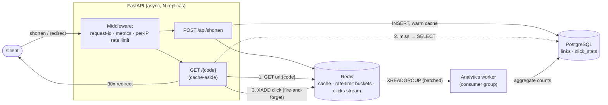

# url-shortener — a backend-at-scale demo

A production-shaped URL shortener built to demonstrate **system design**, not CRUD:
collision-free code generation, Redis cache-aside on the hot path, an atomic
token-bucket rate limiter, and an **asynchronous** click-analytics pipeline that
keeps writes off the redirect path.

- **Stack:** Python 3.12 · FastAPI (async) · PostgreSQL · Redis · Docker Compose
- **One command to run everything:** `docker compose up` → `api` + `db` + `redis` + `worker`
- **Tests:** 36 pytest cases · **CI:** GitHub Actions (ruff + tests + Redis integration)
- **Measured (local, emulated-Postgres harness):** cache cut redirect **p50 latency 76% (187 ms → 45 ms)** and raised **throughput 2.9× (261 → 748 req/s)**. See [Load test](#load-test).

---

## Architecture



<details>
<summary>ASCII fallback</summary>

```
            ┌──────────────────────── FastAPI (async) ───────────────────────┐
 Client ──► │ [request-id · metrics · per-IP token-bucket rate limit]         │
            │   POST /api/shorten ─► INSERT ─► Postgres   (+ warm Redis cache) │
            │   GET  /{code}      ─► (1) Redis GET url:{code}                  │
            │                        (2) miss ─► Postgres SELECT ─► set cache  │
            │                        (3) XADD click  ──────────────┐          │
            │                        (4) 301/302 redirect ─► Client │          │
            └────────────────────────────────────────────────────────────────┘
                                                                   │ Redis Stream "clicks"
                                                                   ▼
                                        Analytics worker  ◄── XREADGROUP (consumer group, batched)
                                          └─ aggregate ─► Postgres (links.click_count, click_stats)
```
</details>

The redirect path touches Postgres **only on a cache miss** and never writes
synchronously. Click analytics are appended to a Redis Stream and folded into
Postgres out-of-band by a separate worker process.

---

## Design decisions & tradeoffs

### 1. Code generation: counter + base62 (not random hash)
`code = base62(db_id + offset)`. The id is a monotonic database counter, so codes
are **unique by construction** — there is no collision-retry loop.

| | Counter + base62 (chosen) | Random hash (e.g. `md5(url)[:7]`) |
|---|---|---|
| Collisions | Impossible | Probabilistic; grows with table size |
| Writes | 1 INSERT | INSERT + retry on each collision (extra DB reads) |
| Code length | Shortest (dense keyspace) | Longer to keep collision odds low |
| Enumerable? | **Yes** — main tradeoff | No |

**Mitigation for enumeration:** an `offset` so we never expose tiny ids, and the
keyspace can be run through a reversible scramble (Feistel/Hashids) before
encoding if unguessability is required. Codes are **never** used for
authorization — they're identifiers, not secrets. See [app/base62.py](app/base62.py).

> **Scaling note:** a single counter is a write coordination point. Postgres makes
> this a cheap sequence; at extreme write volume you hand out *ranges* of ids per
> app instance (the Flickr "ticket server" pattern) to remove the per-write
> coordination. Noted as future work.

### 2. Cache-aside for `code → url`
Reads check Redis first; on a miss we read Postgres and populate the cache
([app/cache.py](app/cache.py), [app/routes/redirect.py](app/routes/redirect.py)).
Mappings are immutable, so a long TTL (1 h) is safe. The write path **warms the
cache**, so even the first redirect of a new link is a hit.

- **Negative caching:** unknown codes are cached with a *short* TTL (30 s) under a
  sentinel value. This stops cache **penetration** — a flood of requests for
  non-existent codes would otherwise miss every time and hammer Postgres.
- **Tradeoff:** a tiny window where a just-created code could be negatively cached;
  bounded to the 30 s negative TTL and avoidable by warming on write (which we do).

### 3. Rate limiting: token bucket in Redis, via Lua
Per-IP token bucket ([app/ratelimit.py](app/ratelimit.py)). Chosen over a
fixed-window counter because it **smooths bursts** (a client may spend up to the
bucket capacity instantly, then is throttled to the refill rate) and avoids the
fixed-window boundary flaw where 2× the limit slips through across a window edge.

The read-modify-write of the bucket runs as a **single atomic Lua script** — two
concurrent requests can't both read the same token count and double-spend (this is
covered by a concurrency test). Rejections return **429** with `Retry-After` and
`X-RateLimit-Limit / -Remaining / -Reset` headers.

> Gotcha handled: Redis truncates Lua numeric returns to integers, so
> `retry_after`/`reset` are rounded (ceil) **inside** the script, not in Python.

### 4. Analytics are asynchronous — the whole point
A redirect's job is to be fast. It `XADD`s a small click event to a Redis Stream
and returns immediately ([app/analytics.py](app/analytics.py)); a **separate worker
process** ([app/worker.py](app/worker.py)) consumes via a **consumer group**,
batches, and folds counts into Postgres.

- **Consumer group (XREADGROUP), not a list (BRPOP):** at-least-once delivery
  (unacked entries survive a crash in the Pending Entries List and are redelivered),
  explicit ACK after a successful flush, and horizontal scale by adding workers.
- **Batched upserts:** one `UPDATE` per distinct link per flush, so Postgres write
  load scales with *distinct links*, not raw click volume.
- **Best-effort emit:** if Redis is briefly unavailable, the click is dropped
  rather than failing the user's redirect.

### 5. Why Redis Streams, not Kafka
The requirement allows Kafka but says keep it optional. Redis is **already** in the
stack for caching and rate limiting, and Redis Streams give exactly what this
workload needs — an append-only log with consumer groups, acks, and replay — with
**zero extra infrastructure**. Kafka earns its operational weight at multi-consumer,
multi-day-retention, very-high-throughput scale; here it would be cost without
benefit. The producer/worker split is identical regardless, so swapping the
transport later is localized to two files.

### 6. 301 vs 302
Configurable (`REDIRECT_STATUS_CODE`, default **302**). 301 is permanent and gets
aggressively cached by browsers/CDNs — fastest for users but you **stop seeing most
clicks** (bad for analytics). 302 keeps every click flowing through the service. We
default to 302 because analytics is a first-class feature here.

### 7. One codebase, two backend profiles
The same code runs on **Postgres + Redis** (Docker) and on **SQLite + fakeredis**
(tests/CI/local) purely via config — no `if local:` branches. This keeps the test
suite hermetic (no Docker needed for `pytest`) while production uses the real
engines. Backend-specific concerns (connection pooling, `ON CONFLICT` upserts) are
isolated to [app/database.py](app/database.py) and [app/worker.py](app/worker.py).

---

## API

| Method | Path | Description |
|---|---|---|
| `POST` | `/api/shorten` | Body `{url, custom_alias?, expires_at?}` → `201` with `{code, short_url, …}`. `409` if alias taken, `422` on invalid URL. |
| `GET` | `/{code}` | `301/302` redirect. `404` unknown, `410` expired, `429` rate-limited. |
| `GET` | `/api/stats/{code}` | Aggregated click count for a code. |
| `GET` | `/health`, `/health/live`, `/health/ready` | Liveness + readiness (checks DB & Redis). |
| `GET` | `/metrics` | Prometheus metrics. |
| `GET` | `/docs` | OpenAPI UI. |

```bash
# Shorten
curl -X POST localhost:8000/api/shorten -H 'content-type: application/json' \
  -d '{"url":"https://example.com/a/very/long/path"}'
# -> {"code":"4c92","short_url":"http://localhost:8000/4c92", ...}

# Redirect (don't follow, inspect the 302)
curl -i localhost:8000/4c92

# Custom alias + expiry
curl -X POST localhost:8000/api/shorten -H 'content-type: application/json' \
  -d '{"url":"https://example.com","custom_alias":"launch","expires_at":"2027-01-01T00:00:00Z"}'
```

---

## Run it

### Docker (full stack)
```bash
docker compose up --build      # starts api + db + redis + worker
# api on http://localhost:8000  (Swagger at /docs)
```

### Locally without Docker (SQLite + fakeredis)
```bash
pip install -r requirements.txt
USE_FAKE_REDIS=true DATABASE_URL="sqlite+aiosqlite:///./shortener.db" \
  uvicorn app.main:app --reload
```

Configuration is environment-driven — see [.env.example](.env.example).

---

## Observability
- **Structured logging:** every line is JSON (structlog) with a per-request
  `request_id` bound in middleware for correlation. [app/logging_config.py](app/logging_config.py)
- **Metrics:** Prometheus at `/metrics` — request count/latency histograms, plus
  domain counters: `cache_events_total{result}`, `rate_limited_total`,
  `redirects_total{status}`. [app/metrics.py](app/metrics.py)
- **Health:** `/health/live` (process up) and `/health/ready` (DB + Redis reachable,
  returns `503` when degraded). [app/routes/health.py](app/routes/health.py)

---

## Testing
```bash
pytest -q          # 36 tests, hermetic (SQLite + fakeredis), no Docker needed
ruff check .
```
Coverage targets the parts where the design lives, not line count:
- `test_base62.py` — round-trip, ordering, **zero collisions over a dense range**
- `test_ratelimit.py` — burst/exhaust/refill, isolation, **atomic no-double-spend under concurrency**
- `test_cache.py` — hit/miss/negative semantics and TTLs
- `test_redirect_flow.py` — end-to-end shorten→redirect, cache hit, alias collision (409), validation (422), expiry (410), 404, rate-limit headers, click enqueue
- `test_worker.py` — stream events → aggregated counts in the DB

---

## CI/CD
[.github/workflows/ci.yml](.github/workflows/ci.yml) runs on every push/PR:
`ruff` lint → `pytest` (SQLite + fakeredis) → a **Redis integration smoke test**
against a real `redis:7` service container (exercises the rate-limiter Lua against
a genuine server, not just fakeredis).

---

## Load test

**Goal:** measure the redirect hot path with the cache **off** vs **on**.

**Honest methodology note.** This was run on a single machine with **no Docker**, so
there is no real Postgres/Redis — the app uses its SQLite + fakeredis profile, both
**in-process**. SQLite reads from the OS page cache in microseconds, so a cache in
front of it shows *no* benefit locally; the cache-aside pattern only pays off when
the primary store is a **networked** database whose latency and finite connection
pool are the bottleneck. To reproduce that bottleneck faithfully — and *only* for
the benchmark — the cache-miss DB read is wrapped in a **declared simulation**
(`DB_READ_LATENCY_MS=20`, `DB_SIM_POOL=8`): the "database" serves at most 8
concurrent reads, each taking 20 ms, exactly like a connection pool of 8 over a
20 ms query. This is off by default and in all tests (see
[app/config.py](app/config.py) / [app/service.py](app/service.py)). Everything else
— the cache code, redirect path, metrics, the load generator — is real.

The load generator is [loadtest/benchmark.py](loadtest/benchmark.py) (an
asyncio+httpx harness; equivalent in intent to the included
[locustfile.py](locustfile.py), which targets the Docker/Python-3.12 stack where
Locust's gevent dependency is supported). 50 concurrent clients, 20 s, hammering a
hot set of 10 codes:

```bash
# before: cache off, DB is the bottleneck
DB_READ_LATENCY_MS=20 DB_SIM_POOL=8 CACHE_ENABLED=false RATE_LIMIT_ENABLED=false \
  USE_FAKE_REDIS=true uvicorn app.main:app --port 8001 --workers 1
python loadtest/benchmark.py --host http://127.0.0.1:8001 --concurrency 50 --duration 20

# after: cache on, hot reads bypass the DB pool
DB_READ_LATENCY_MS=20 DB_SIM_POOL=8 CACHE_ENABLED=true RATE_LIMIT_ENABLED=false \
  USE_FAKE_REDIS=true uvicorn app.main:app --port 8002 --workers 1
python loadtest/benchmark.py --host http://127.0.0.1:8002 --concurrency 50 --duration 20
```

### Results (measured)

| Metric | Before (no cache) | After (cache) | Change |
|---|---:|---:|---|
| Throughput | **261 req/s** | **748 req/s** | **+186 % (2.9×)** |
| Latency p50 | 187 ms | **45 ms** | **−76 %** |
| Latency p95 | 218 ms | 202 ms | ~flat |
| Latency p99 | 225 ms | 336 ms | tail noise† |
| Requests / 20 s | 5,282 | 15,025 | — |
| Cache hit ratio (hot set) | — | **~100 %** (15,035 hits, 0 misses post-warm) | ~all DB reads eliminated |

Raw output: [loadtest/before.json](loadtest/before.json),
[loadtest/after.json](loadtest/after.json).

The headline wins are **throughput** and **median latency**: with the cache, hot
redirects skip the (simulated) DB pool entirely, lifting the ceiling from
~pool-bound 261 req/s to ~event-loop-bound 748 req/s and cutting p50 from 187 ms to
45 ms.

† The "after" p99 is noisier than "before" because at ~750 req/s the single test
worker is event-loop-bound and co-located with the load generator and fakeredis on
one box; tail latency reflects GC/scheduling jitter, not the cache. On separate,
networked Postgres + Redis the absolute numbers differ but the *relative* cache win
is typically **larger** (a remote SELECT under pool contention ≫ a sub-ms Redis GET).

---

## Project layout
```
app/
  base62.py        # counter -> short code codec
  cache.py         # cache-aside (positive + negative caching)
  ratelimit.py     # token bucket (atomic Redis Lua)
  analytics.py     # click producer -> Redis Stream
  worker.py        # consumer-group worker -> aggregated counts
  service.py       # create/resolve links, collision handling
  routes/          # shorten, redirect, health/metrics
  middleware.py    # request-id, metrics, per-IP rate limit
  config.py · database.py · redis_client.py · models.py · schemas.py · logging_config.py · metrics.py
tests/             # base62, ratelimit, cache, redirect flow, worker
loadtest/          # asyncio benchmark + captured before/after JSON
docker-compose.yml · Dockerfile · locustfile.py · .github/workflows/ci.yml
```

## Future work
- ID **range allocation** per instance (ticket-server) to remove the single-counter
  write coordination.
- Reversible code scrambling (Feistel) when unguessable codes are required.
- Full SSRF protection (resolve + re-check destination IPs at request time).
- Promote schema management to Alembic migrations (currently `create_all` on boot).
- Grafana dashboard + alerting on the exported Prometheus metrics.
